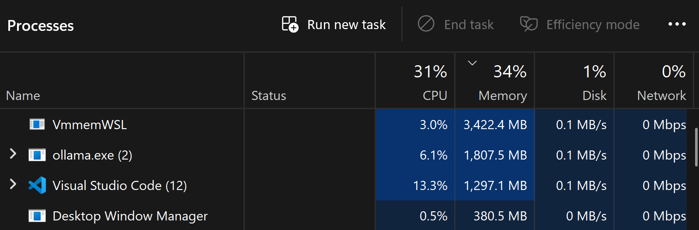

# Two Experiments in Parallel: Building a Text-to-SQL Agent While Testing a Collaboration Methodology

*Part 1 of 2 — From Notebook Exploration to Structured Evaluation*

**By Alberto Diaz Durana | February 2026**

---

This post is about running two experiments at the same time.

The first experiment: can a small, local LLM (7-8 billion parameters, running on my machine) translate plain English questions into correct SQL queries? The second experiment: can a human and an AI agent collaborate effectively on a data science project if they follow a structured methodology?

Both experiments share the same core loop: research what's known, build something, measure how well it works, learn from the failures, and iterate. This post covers what happened when I applied that loop to both problems simultaneously — the surprises, the dead ends, and the things I'd do differently.

## The Setup

The project is a text-to-SQL agent powered by [Ollama](https://ollama.ai/), an open-source tool for running LLMs locally. No cloud APIs, no API keys, no data leaving the machine. At its core, this is a code generation problem — the model must produce syntactically valid, semantically correct programs from a natural language specification. SQL's constrained grammar makes it an ideal testbed: structured enough to evaluate systematically, complex enough to expose real limitations in how models reason about code.

The database is Chinook — a sample music store database with 11 tables covering artists, albums, tracks, customers, and invoices. I chose it because it's small, well-understood, and free — a controlled environment for testing — but also because I like music, and querying a database you're genuinely curious about makes the debugging more enjoyable.

The collaboration follows the [Data Science Methodology (DSM)](https://github.com/albertodiazdurana/agentic-ai-data-science-methodology), a structured framework I'm developing for AI-assisted data science projects. This SQL agent is DSM's first real-world case study, and the relationship is bidirectional — the methodology shapes how the project is organized (sprint structure, experiment templates, decision logs), and the project feeds observations back to improve the methodology (gaps found, templates refined, missing conventions added). Neither is static; both evolve together.

I should be upfront about scope. This is a prototype built to test ideas, not a production system. The database is a toy. The test suite has 14 queries, not 10,000. The models are 7-8B parameters, not 70B. These constraints are intentional — the goal is to establish the evaluation framework and the collaboration workflow, then iterate from a measured baseline.

## Starting in the Notebook

Sprint 1 began in a Jupyter notebook, which is the natural habitat for exploration. The collaboration protocol was strict: the AI agent provides one cell at a time, I run it, paste the output back, and we discuss the results before moving on. Every cell got a critical assessment — does this output make sense? Is the schema correct? Why did the model choose that JOIN? Slower than letting the AI run autonomously, but deliberate and controlled — it keeps the human engaged in the reasoning, not just approving outputs.

The agent architecture came from surveying the text-to-SQL research. Papers like DIN-SQL [1], MAC-SQL [2], and CHESS [3] all decompose text-to-SQL into specialized sub-tasks rather than asking the model to do everything at once. The key insight was that schema filtering (selecting which tables to include in the prompt) is the single most impactful sub-task [3], and that a structured graph works better than free-form reasoning for small models — 7B-13B models struggle with ReAct-style tool selection, producing wrong tool order and hallucinated tool names [4]. That led to a five-node [LangGraph](https://langchain-ai.github.io/langgraph/) pipeline:

1. **Schema filter** — select relevant tables based on the question
2. **Generate SQL** — call the LLM with the filtered schema
3. **Validate** — check syntax with sqlglot before hitting the database
4. **Execute** — run the query and return results
5. **Handle error** — if something breaks, feed the error back to the LLM for repair (the self-correction pattern, which research shows adds +5-10% accuracy with 2-3 retries [5])

```
[schema_filter] → [generate_sql] → [validate_query] → [execute_query] → [END]
                        ^                  |                    |
                        |                  v                    v
                        +--------- [handle_error] <-----------+
                                   (max 3 retries)
```

This is a [LangGraph](https://langchain-ai.github.io/langgraph/) state graph — each node reads from and writes to a shared state object that carries the question, filtered schema, generated SQL, validation results, and execution output through the pipeline. The graph enforces a fixed execution order with conditional routing: after validation, the graph either proceeds to execution or branches to error handling, and after execution, it either finishes or retries (up to 3 attempts). This structured approach was a deliberate choice over LangChain's built-in `create_sql_agent`, which uses a ReAct loop where the model decides which tool to call next. Research and our own experience confirmed that 7-8B models struggle with ReAct-style reasoning [4] — they pick wrong tools, loop, or hallucinate tool names. A fixed graph with conditional edges gives the small model a constrained path to follow instead of asking it to plan its own.

I built and tested each node individually before wiring the graph together. That incremental approach paid off immediately: when I first tested `sqlcoder:7b` (a SQL-specialized fine-tuned model from [Defog](https://github.com/defog-ai/sqlcoder)), it returned empty responses. The model required a specific prompt format (`### Task` headers instead of plain instructions). I would have spent much longer debugging this if the whole graph had been wired up at once.

Then came a more interesting discovery. The SQL-specialized model kept generating PostgreSQL syntax — `ILIKE` instead of `LIKE`, `NULLS LAST` in ORDER BY clauses, `snake_case` column names instead of PascalCase. I tried fixing this through prompt instructions ("Use SQLite syntax"), but the fine-tuning was stronger than the prompt. The model had been trained on PostgreSQL and it was going to write PostgreSQL.

The fix was programmatic: a post-processing step that normalizes the SQL dialect after generation. ILIKE becomes LIKE, NULLS LAST gets removed, column names get mapped back to their actual casing. This was a useful lesson — you can't always prompt your way out of a model's training bias. Sometimes you need code.

Along the way, I used the agent to explore the database itself. The Chinook music store has 132 Iron Maiden tracks and 112 Metallica tracks, which I found personally satisfying. There's a practical point here too: actually *using* the tool you're building reveals things that unit tests don't.

## Leaving the Notebook

Midway through the evaluation phase, the notebook started to hurt. I hit a namespace collision when trying to build a reusable evaluation harness — the notebook's flat namespace made it hard to separate the agent code from the evaluation logic. The cells were getting long. Running the same 14 queries against two models meant re-executing the entire notebook twice, carefully, without accidentally reusing state.

This is a transition that anyone who works in notebooks recognizes: the moment when exploration needs to become engineering. I extracted the evaluation harness into a standalone Python script (`eval_harness.py`) and the experiment runner into another (`run_experiment.py`). Now I could run `python run_experiment.py llama3.1:8b` from the command line and get reproducible results written to JSON — one command, one model, structured output. The pipeline was designed for fast iteration: swap a model name, re-run, compare.

The transition wasn't seamless. The first extraction had import issues. The hardcoded Ollama URL worked differently from WSL than from the notebook. Small friction — but it reinforced that moving from exploration to execution is a real engineering task, not just a copy-paste operation.

## The Evaluation

With reproducible scripts in place, I ran a structured experiment comparing two open-source models: `sqlcoder:7b` (a SQL-specialized fine-tune built on StarCoder) and `llama3.1:8b` (Meta's general-purpose model). Both run locally via Ollama — understanding what open-source models can and can't do for code generation at the 7-8B parameter scale is one of the central questions.

The experiment followed a template from the methodology: define hypotheses before testing, specify rejection criteria, and track everything. The three hypotheses were:

- **H1:** The SQL-specialized model will achieve higher accuracy (benchmarks show SQLCoder-7B at 65-70% EX on Spider vs. ~50-60% for Llama 3.1 8B [6][7])
- **H2:** The general-purpose model will produce more readable SQL
- **H3:** The fine-tuned model will need more dialect post-processing due to PostgreSQL bias

The test suite had 14 queries across three difficulty levels — following the tiered structure used by benchmarks like Spider [8] and BIRD [9]: 5 Easy (single table, simple aggregation), 5 Medium (JOINs, GROUP BY, HAVING), and 4 Hard (multi-table JOINs, subqueries, complex aggregation). Each query had pre-computed ground truth, and we adapted Spider's Execution Accuracy (EX) metric [8] for local evaluation: both the generated query and the reference query are executed against the database, and the result sets are compared — if they match, the query is correct regardless of how the SQL is written. Beyond EX, we tracked three supporting metrics: **Raw Parsability** (does the generated SQL parse as valid syntax?), **Table Hallucination** (does the model reference tables that don't exist in the schema?), and **Latency** (time from question to answer). Together, these tell you not just *how often* the model is right, but *how* it fails when it's wrong.

### The Results

| Metric | sqlcoder:7b | llama3.1:8b |
|--------|-------------|-------------|
| Execution Accuracy | 42.9% (6/14) | 42.9% (6/14) |
| Raw Parsability | 85.7% | **100%** |
| Table Hallucination | 2 instances | **0** |
| Avg Latency | 30.3s | **17.6s** |

The headline: **identical accuracy**. The SQL-specialized model provided zero advantage. H1 — rejected.

But the numbers underneath tell a more interesting story. `llama3.1:8b` produced valid SQL 100% of the time. Zero hallucinated tables. Nearly twice as fast. Its failures were all logic errors — the SQL was valid and ran, it just returned wrong results. Predictable, debuggable failures.

`sqlcoder:7b` was messier. It hallucinated three non-existent tables across the test suite (it invented `payment`, `media_type`, and `invoiceintrack` — probably from its training data). Two queries produced runtime errors, likely from exceeding the context window on complex prompts. Its failures were diverse and harder to predict.

By difficulty:

| Level | sqlcoder:7b | llama3.1:8b |
|-------|-------------|-------------|
| Easy | 80% | **100%** |
| Medium | 40% | 20% |
| Hard | 0% | 0% |

Both models hit a wall at Hard difficulty. Zero correct answers on multi-table JOINs with subqueries. At the 7-8 billion parameter scale, complex relational reasoning is beyond reach. For context, even GPT-4 with specialized pipelines reaches only ~85-91% EX on Spider [1][10], and Spider 2.0's enterprise-complexity queries brought frontier models down to ~31% EX [11]. The Hard query ceiling at 7-8B isn't surprising — but measuring it precisely (and categorizing the failure modes) gives us a clear target for improvement.

What about the other two hypotheses? H2 (readable SQL) was partially confirmed — `llama3.1:8b` produced consistent table aliases and JOINs that included human-readable names, while `sqlcoder:7b` was less consistent. H3 (dialect post-processing) was inconclusive — we could see from Phase 2 that sqlcoder produced more PostgreSQL-isms, but a measurement limitation in how post-processing was integrated into the pipeline meant we couldn't quantify it reliably. Fixing that measurement architecture is one of Sprint 2's priorities.

## Challenges

Beyond the technical findings, two practical challenges stood out — neither visible in the evaluation metrics but both worth flagging for anyone attempting something similar.

**Running local LLMs on a laptop.** This entire project runs on a consumer laptop. The screenshot below shows what a typical development session looks like in Task Manager: Ollama holding ~1.8GB for the model weights, WSL consuming ~3.4GB, VSCode with 12 processes at ~1.3GB. That's over 6GB just for the development environment, before the model starts generating tokens. During evaluation runs, inference pushed latency to 30-45 seconds per query on Hard difficulty — and you're running 14 queries per model, two models. Patience required.



This is the trade-off of local LLMs: full privacy and zero API costs, but your hardware is the bottleneck. A faster GPU would help; a cloud API would be instant — but that defeats the purpose.

**The invisible collaboration bypass.** During Sprint 2, the IDE was auto-accepting every file edit without showing an approval dialog. The AI agent wrote four files before I noticed that changes were being applied without my review. The fix was a single VSCode setting (`initialPermissionMode: default`), but the experience highlighted a real risk: collaboration tools can silently remove the human from the loop if the defaults aren't configured for it.

## What We Learned

**About the models:** SQL fine-tuning at small scale adds risk (hallucination, dialect bias) without adding accuracy. A general-purpose model is more reliable and faster. A practical experience report from nilenso [12] reached a similar conclusion — local LLMs achieve comparable accuracy to frontier models on easy/moderate tasks, and prompt minimalism helps more than model specialization. For a user-facing application, predictable failures are better than diverse ones.

**About evaluation:** Defining hypotheses before testing forced us to actually check our assumptions instead of confirming them. The structured error categorization (schema linking, syntax, dialect, hallucination, logic) turned vague "it got it wrong" observations into actionable improvement targets. Each failure category maps to a specific fix: hallucination → schema-aware validation, logic → few-shot examples, dialect → post-processing rules.

**About the notebook-to-script transition:** Know when to leave the notebook. If you need reproducibility, reusability, or clean separation of concerns, extract to scripts. The cost is real (import issues, path juggling, environment differences) but it enables structured evaluation that notebooks make painful.

**About the collaboration:** The one-cell-at-a-time protocol in the notebook was slow but caught the sqlcoder prompt issue early. The structured methodology — decision logs, experiment templates, limitation registries — created artifacts that now feed directly into Sprint 2's backlog. Every limitation has a number, a severity, and a disposition. That's not overhead; it's the input for the next iteration.

## The Loop

The experiment produced six formal limitations (LIM-001 through LIM-006), each with a severity rating and a path forward. Two of them — separating raw from post-processed SQL for metrics, and adding few-shot examples to prompts (research shows +10-20% accuracy for 7B models with well-selected examples [10][13]) — are the first priorities for Sprint 2.

Meanwhile, the project also produced fourteen feedback entries for the methodology itself: gaps in documentation templates, missing naming conventions, a blog file organization issue, and an IDE permission setting that silently bypassed human review of file changes. The methodology improves alongside the project.

This is the loop: research → build → measure → learn → feed back → iterate. It's the same whether you're improving an LLM agent or improving the way you work with an AI collaborator. The SQL agent is at 42.9% accuracy and climbing. The methodology is at version 1.1 and refining. Both are prototypes. Both have measured baselines and clear next steps.

## What's Next

Part 2 of this series will cover Sprint 2: taking the model we selected and building a Streamlit application from the notebook prototype. The focus shifts from exploration to implementation — extracting code into modules, adding few-shot examples, building a user interface. It's a different kind of challenge: not "can this work?" but "can this become something someone else can use?"

More broadly, the evaluation methodology — hypothesis-driven experiments, structured error categorization, reproducible pipelines — isn't specific to SQL. The same approach applies to any code generation task. SQL was the starting point; the framework is the lasting artifact.

I'll also introduce [DSM Graph Explorer](https://github.com/albertodiazdurana/agentic-ai-data-science-methodology), a second case study that validates the methodology by building a tool that analyzes the methodology itself. Dog-fooding at two levels — but that's a story for Part 2.

If you've worked with local LLMs for code generation — or tried to build a systematic evaluation for LLM outputs — I'd be curious to hear what worked and what didn't. What did your failure modes look like?

---

*The SQL Query Agent project is open source: [github.com/albertodiazdurana/sql-query-agent-ollama](https://github.com/albertodiazdurana/sql-query-agent-ollama)*

*The Data Science Methodology (DSM) is also open source: [github.com/albertodiazdurana/agentic-ai-data-science-methodology](https://github.com/albertodiazdurana/agentic-ai-data-science-methodology)*

---

## References

[1] Pourreza, M. & Rafiei, D. (2023). "DIN-SQL: Decomposed In-Context Learning of Text-to-SQL with Self-Correction." *NeurIPS 2023.* [arXiv:2304.11015](https://arxiv.org/abs/2304.11015)

[2] Wang, E. et al. (2023). "MAC-SQL: A Multi-Agent Collaborative Framework for Text-to-SQL." [arXiv:2312.11242](https://arxiv.org/abs/2312.11242)

[3] Talaei, S. et al. (2024). "CHESS: Contextual Harnessing for Efficient SQL Synthesis." [arXiv:2405.16755](https://arxiv.org/abs/2405.16755)

[4] LangChain documentation on structured graphs vs. ReAct for text-to-SQL. [LangGraph](https://langchain-ai.github.io/langgraph/)

[5] Self-correction pattern for text-to-SQL: multiple studies report +5-10% accuracy with 2-3 retries. See DIN-SQL [1] and MAC-SQL [2] for implementations.

[6] Defog. "SQLCoder: A state-of-the-art model for generating SQL queries." [github.com/defog-ai/sqlcoder](https://github.com/defog-ai/sqlcoder)

[7] Performance tiers compiled from Spider leaderboard and Defog benchmarks. See [our full research summary](https://github.com/albertodiazdurana/sql-query-agent-ollama/blob/main/docs/research/text_to_sql_state_of_art.md).

[8] Yu, T. et al. (2018). "Spider: A Large-Scale Human-Labeled Dataset for Complex and Cross-Domain Semantic Parsing and Text-to-SQL Task." *EMNLP 2018.* [yale-lily.github.io/spider](https://yale-lily.github.io/spider)

[9] Li, J. et al. (2023). "Can LLM Already Serve as A Database Interface? A BIg Bench for Large-Scale Database Grounded Text-to-SQLs." *NeurIPS 2023.* [arXiv:2305.03111](https://arxiv.org/abs/2305.03111)

[10] Gao, D. et al. (2023). "How to Prompt LLMs for Text-to-SQL: A Study in Zero-shot, Single-domain, and Cross-domain Settings." [arXiv:2305.11853](https://arxiv.org/abs/2305.11853)

[11] Lei, F. et al. (2024). "Spider 2.0: Evaluating Language Models on Real-World Enterprise Text-to-SQL Workflows." [arXiv:2411.07763](https://arxiv.org/abs/2411.07763)

[12] nilenso (2025). "Experimenting with Self-Hosted LLMs for Text-to-SQL." [blog.nilenso.com](https://blog.nilenso.com/blog/2025/05/27/experimenting-with-self-hosted-llms-for-text-to-sql/)

[13] Gao, D. et al. (2023). "DAIL-SQL: A Systematic Prompting Approach for Text-to-SQL." *VLDB 2024.* [arXiv:2308.15363](https://arxiv.org/abs/2308.15363)
