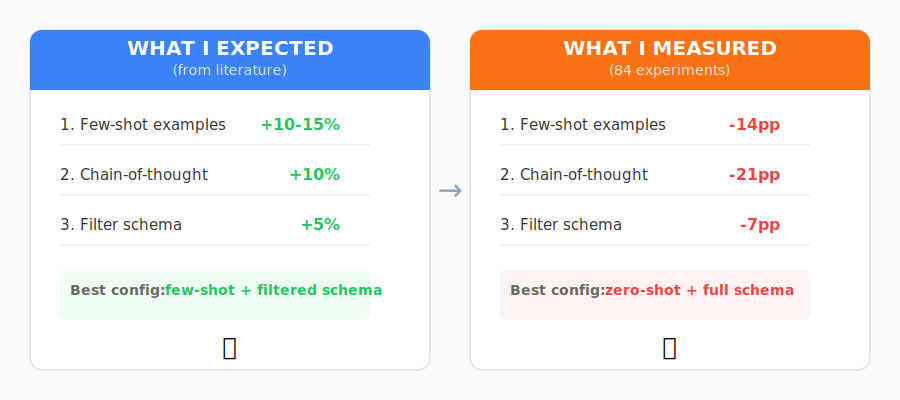

# What 84 Experiments Taught Me About Prompt Engineering — When Best Practices Don't Transfer

*Part 3 of a series on building a text-to-SQL agent while testing a human-AI collaboration methodology*

---

The literature is clear: add few-shot examples to your prompts (+10-15% accuracy) [1], use chain-of-thought reasoning for complex tasks [2], and filter irrelevant context to reduce noise [3]. I ran 84 experiments to validate these assumptions before shipping my text-to-SQL agent.

For my setup, the results were different.

## The Setup

I'm building a natural language to SQL agent (https://github.com/albertodiazdurana/sql-query-agent-ollama) that runs locally using Ollama and llama3.1:8b. Before adding a Streamlit UI in Sprint 2, I wanted to optimize the prompt strategy. The research pointed to three techniques:

1. **Few-shot examples** — Show the model 2-3 question→SQL pairs before asking it to generate
2. **Chain-of-thought (CoT)** — Ask the model to reason step-by-step before writing SQL
3. **Schema filtering** — Only include relevant tables instead of the full 11-table schema

I designed an ablation study following the AbGen framework [4]: 3 prompt types × 2 schema strategies × 14 test queries = 84 experimental runs.

## The Hypothesis

Based on the literature:

- **H1:** Few-shot examples will improve execution accuracy by 10-15% [1]
- **H2:** Chain-of-thought will help on complex multi-table queries [2]
- **H3:** Selective schema (fewer tables) will reduce confusion and improve accuracy [3]

I was ready to implement few-shot as the default. The ablation was just validation.

## The Results

| Configuration | Execution Accuracy | Syntax Valid | Avg Latency |
|--------------|-------------------|--------------|-------------|
| **zero_shot_full** | **50% (7/14)** | 100% | 8.97s |
| zero_shot_selective | 43% (6/14) | 93% | 12.17s |
| few_shot_full | 36% (5/14) | 100% | 8.46s |
| few_shot_selective | 43% (6/14) | 100% | 11.54s |
| cot_full | 29% (4/14) | 93% | 7.78s |
| cot_selective | 43% (6/14) | 100% | 11.37s |

Wait, what?

**Zero-shot with full schema won.** The simplest approach — just ask the question with all tables — outperformed the more complex techniques.

## What Went Wrong (For the Techniques)

### Few-Shot Examples Hurt (-14 percentage points)

Adding two examples (employee count, AC/DC albums) *reduced* accuracy from 50% to 36%.

My hypothesis: the examples anchored the model on patterns that didn't generalize. When the model saw "How many tracks are in the Rock genre?", it pattern-matched to "How many employees?" and generated a simple COUNT. But the query needed a JOIN through the Genre table — a pattern not present in the examples.

Few-shot works when your examples cover the query patterns you'll encounter. Static examples on a diverse query set can mislead more than help.

### Chain-of-Thought Was the Worst Performer (-21 percentage points)

CoT achieved only 29% accuracy — the worst of all configurations. The reasoning scaffold consumed context without adding value. Instead of focusing on SQL generation, the model spent tokens explaining what it *would* do, then generated worse SQL.

For constrained code generation tasks, explicit reasoning may dilute focus. The model doesn't need to "think through" SQL syntax — it needs to map the question to the right tables and columns.

### Selective Schema Filtering Backfired

I expected that showing only 3-4 relevant tables (instead of all 11) would help the model focus. Instead, selective filtering *hurt* accuracy.

The problem: my keyword-based filter removed tables needed for JOINs. The question "Find customers who bought Jazz tracks" mentions "customers" and "Jazz" but needs the Invoice, InvoiceLine, Track, and Genre tables. Naive filtering cut essential links.

Full schema provides the complete picture. The model can figure out what to ignore.

## The Counter-Intuitive Lesson

*Left: Literature recommendations. Right: Results from 84 experiments on llama3.1:8b.*

The techniques that work for GPT-4 and larger models may not transfer to 8B local models:

1. **Few-shot examples need careful curation** — Bad examples are worse than no examples
2. **CoT adds overhead without benefit** for constrained generation tasks
3. **More context can be better** — Let the model filter, don't filter for it

## What I Would Have Shipped Without This Data

If I'd applied the literature recommendations without local testing:

- **Few-shot prompt** as default → 36% accuracy instead of 50%
- **Schema filtering** enabled → 43% instead of 50%
- **14 percentage points left on the table** — a third of my correct queries

The ablation took 15 minutes to run. It saved me from shipping a worse product.

## The Methodology Takeaway

This validates a principle I'm building into my Data Science Methodology (https://github.com/albertodiazdurana/agentic-ai-data-science-methodology): **empirical validation over literature assumptions**.

Research findings are averages across models, datasets, and conditions. Your specific combination may behave differently. The only way to know is to measure.

The ablation study is now a standard step in my workflow: before committing to a prompt strategy, run the matrix and let the data decide.

## Practical Recommendations

If you're building with local 8B models:

1. **Start with zero-shot** — Add complexity only if data shows it helps
2. **Test few-shot carefully** — Your examples may hurt more than help
3. **Skip CoT for code generation** — The overhead isn't worth it at this scale
4. **Provide full context** — Let the model filter, don't assume you know what's relevant
5. **Measure before shipping** — 84 runs took 15 minutes and changed my default configuration

## What's Next

The agent now uses zero-shot prompting with full schema, achieving 50% execution accuracy on a 14-query test suite. That's 7.1 percentage points above my Sprint 1 baseline — and I got there by *removing* features, not adding them.

Part 4 will cover shipping the Streamlit UI and why I chose Docker over cloud deployment. The local-first architecture is a deliberate trade-off: your data never leaves your machine.

---

**Code:** https://github.com/albertodiazdurana/sql-query-agent-ollama

**Experiment data:** https://github.com/albertodiazdurana/sql-query-agent-ollama/tree/main/data/experiments/s02_ablation

**Previous posts:**
- [Part 1: Two Experiments in Parallel](https://www.linkedin.com/posts/albertodiazdurana_texttosql-codegeneration-llms-activity-7424243816100036608-as2b)
- [Part 2: The Case for Human-Agent Collaboration](https://www.linkedin.com/posts/albertodiazdurana_machinelearning-aiengineering-softwaretesting-activity-7424401395388354560-2rbd)

---

## References

[1] Brown, T. et al. (2020). "Language Models are Few-Shot Learners." *NeurIPS 2020*. https://arxiv.org/abs/2005.14165

[2] Wei, J. et al. (2022). "Chain-of-Thought Prompting Elicits Reasoning in Large Language Models." *NeurIPS 2022*. https://arxiv.org/abs/2201.11903

[3] Pourreza, M. & Rafiei, D. (2023). "DIN-SQL: Decomposed In-Context Learning of Text-to-SQL with Self-Correction." *NeurIPS 2023*. https://arxiv.org/abs/2304.11015

[4] Chen, X. et al. (2025). "AbGen: A Framework for LLM Ablation Studies." *ACL 2025*. https://aclanthology.org/2025.acl-long.611/

[5] Yu, T. et al. (2018). "Spider: A Large-Scale Human-Labeled Dataset for Complex and Cross-Domain Semantic Parsing and Text-to-SQL Task." *EMNLP 2018*. https://arxiv.org/abs/1809.08887

[6] Gao, D. et al. (2024). "Text-to-SQL Empowered by Large Language Models: A Benchmark Evaluation." *Nature Scientific Reports*. https://www.nature.com/articles/s41598-025-04890-9
