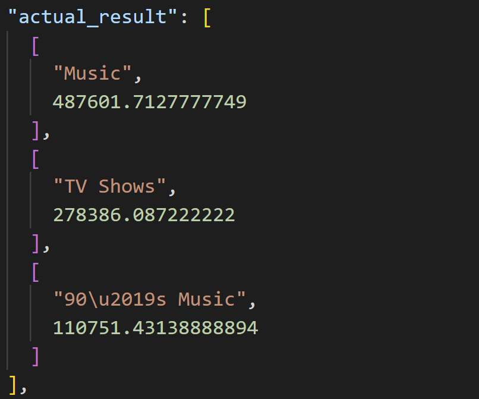

# The Case for Human-Agent Collaboration: What 28 Test Outputs Taught Me About Cognitive Limits

**By Alberto Diaz Durana | February 2026**

---

This is a follow-up to [Part 1: Building a Text-to-SQL Agent](https://www.linkedin.com/posts/albertodiazdurana_texttosql-codegeneration-llms-activity-7424243816100036608-as2b). Here I want to examine something I noticed while running those experiments: **the value of collaborating with an AI agent wasn't just speed — it was catching errors I would have missed.**

## The Pre-LLM Baseline

Before AI-assisted review, how did engineers analyze large test outputs?

The traditional approach had well-documented limitations. Manual test result analysis was slow and inconsistent — human testers execute tests and interpret results in their own way, leading to variability [1]. Research by Capers Jones across 12,000+ software projects found that informal inspections detected fewer than 50% of defects, while formal inspections reached 60-65% — but even formal reviews topped out at 82% detection [2][3].

The core problem is cognitive: **as fatigue increases, accuracy decreases** [4]. Code review fatigue occurs when repeated exposure to similar patterns results in reviewers no longer detecting important errors [5]. One experiment found that checklists significantly lowered cognitive load for complex reviews, but the effect varied with task complexity [6].

The numbers tell a consistent story:
- Fagan's original data: 82% defect detection at ~100-200 lines/hour [2]
- Typical inspection efficiency: 1.6-3.6 defects found per person-hour [7]
- Recommended session limit: 2 hours, because longer durations reduce efficiency [2]

## What Changed With an Agent

During the SQL agent evaluation, I ran 14 queries against 2 models — that's 28 output blocks to compare, each containing:
- Generated SQL (5-20 lines)
- Execution results (1-20 rows)
- Error messages (if any)
- Latency timestamps

The agent parsed all 28 outputs, categorized 16 failures into 6 error categories, and surfaced a pattern: **llama3.1:8b's failures were all logic errors; sqlcoder:7b's failures were diverse (hallucination, runtime, dialect)**. That pattern — which became the key insight for the model recommendation — would have been hard to see manually from raw output.

But more importantly, the agent caught errors I likely would have missed.

## Three Errors a Human Would Miss

### Error 1: The Unit Conversion (H4)

**Question:** "List the top 3 playlists by total track duration in hours"

**Generated SQL:**
```sql
SELECT p.Name, SUM((t.Milliseconds / 3600.0)) AS TotalDurationHours
FROM PlaylistTrack pt
JOIN Track t ON pt.TrackId = t.TrackId
JOIN Playlist p ON pt.PlaylistId = p.PlaylistId
GROUP BY p.Name
ORDER BY TotalDurationHours DESC
LIMIT 3
```

**Result:**
```
Music         487601.71
TV Shows      278386.09
90's Music    110751.43
```

The SQL is syntactically perfect. It executes without errors. It returns three playlists in descending order. **But the numbers are 1000x too high** — the model divided by 3600.0 (seconds to hours) instead of 3600000.0 (milliseconds to hours).

If you're scanning 14 outputs looking for crashes or empty results, you'd likely approve this one. The agent flagged it as a logic error because the expected result was ~487 hours, not 487,601.



### Error 2: The Type Mismatch (H2)

**Question:** "Find customers who have never purchased a Jazz track"

**Generated SQL:**
```sql
SELECT c.*
FROM Customer c
WHERE c.CustomerId NOT IN (
  SELECT t.TrackId
  FROM Track t
  JOIN PlaylistTrack pt ON t.TrackId = pt.TrackId
  JOIN Genre g ON t.GenreId = g.GenreId
  WHERE g.Name = 'Jazz'
)
```

The query runs successfully. It returns customer data. **But the subquery selects `TrackId` and compares it to `CustomerId`** — two unrelated integer columns that happen to have overlapping values.

This is a subtle semantic error that requires reading the subquery carefully. In a batch of 28 outputs, after the fifth or sixth, your eyes glaze over.

### Error 3: The Absurd Revenue (M5)

**Question:** "What are the top 3 best-selling genres by revenue?"

**Result:**
```
Drama           64,564,765,687.27
TV Shows        62,972,228,697.71
Sci Fi & Fantasy 27,573,820,249.20
```

$64 billion in drama revenue? The model used `T.UnitPrice * T.Bytes` instead of joining the InvoiceLine table to get actual sales. The SQL is valid, the result structure is correct, but the values are obviously wrong — **if you're paying attention**.

## The Human in the Loop

This raises an uncomfortable question: **how do I know my agent and I are doing it correctly?**

The agent catches errors I miss. But who catches the agent's errors? This is the verification problem in human-AI collaboration, and it doesn't have a clean answer.

The key is that "human in the loop" isn't just a checkbox — it's a protocol. During Sprint 1, the collaboration followed a strict rule: **one notebook cell at a time**. The agent provides one cell, I run it, paste the output back, and we discuss before proceeding. Every intermediate result gets reviewed. The agent can't silently accumulate errors across 20 cells because there's a human checkpoint after each one.

This is slow. It's also deliberate. The notebook phase took longer than it would have if I'd let the agent run autonomously, but when sqlcoder:7b returned empty responses due to a prompt format issue, we caught it on cell 3 — not cell 20 after the whole pipeline was wired up.

The human in the loop provides three things the agent can't:
- **Domain sanity checks.** The agent doesn't know that $64 billion in drama revenue is absurd. I do.
- **Questioning surprising results.** When both models showed identical accuracy — contradicting published benchmarks — we didn't accept it. We examined error distributions to understand *why*.
- **Protocol enforcement.** The agent follows instructions, but someone has to decide what the instructions should be and whether they're being followed.

## Structured Experiment Design: The Role of DSM

The other half of the answer is **methodology**. We didn't just run queries and eyeball results. The evaluation followed templates from the [Data Science Methodology (DSM)](https://github.com/albertodiazdurana/agentic-ai-data-science-methodology), a framework I'm developing for AI-assisted data science projects.

DSM provides the scaffolding that makes human-agent collaboration auditable:

**Capability Experiment Template (DSM C.1.3).** Every experiment follows the same structure: hypotheses defined before testing, explicit rejection criteria, metrics tracked, and findings documented. We wrote down three predictions (H1: fine-tuned model wins on accuracy, H2: general model produces more readable SQL, H3: fine-tuned model needs more post-processing) *before running a single query*. This prevents post-hoc rationalization — you can't claim you expected the result after seeing it.

**Limitation Discovery Protocol (DSM C.1.5).** Every limitation discovered gets a number (LIM-001 through LIM-006), a severity rating, a type classification, and a disposition (accept, mitigate, or defer). This creates accountability — you can't quietly forget about a problem if it has a tracking ID that feeds into the next sprint's backlog.

**Decision Log (DSM 2.3).** Architectural choices get documented with context, alternatives considered, and rationale. When we chose llama3.1:8b over sqlcoder:7b, that became [DEC-005](https://github.com/albertodiazdurana/sql-query-agent-ollama/blob/main/docs/decisions/DEC-005_model-selection-llama3-1-8b.md) — not a verbal agreement that gets forgotten, but a numbered record that can be referenced and questioned.

**Structured Error Categorization.** Failures weren't just "wrong" — they were classified into six categories (schema linking, syntax, dialect, hallucination, logic, unknown). Each category maps to a specific fix. If the agent miscategorized, the fix wouldn't work, and we'd notice downstream.

The methodology does two things: it forces rigor (you can't skip steps when they're in a template), and it creates artifacts that can be audited. If someone questions our conclusions, they can read the hypotheses, the rejection criteria, the per-query results, and the error categorizations. The reasoning is visible.

This is also bidirectional. DSM provides the structure, but the project feeds observations back into DSM — gaps in templates, missing conventions, workflow friction. The methodology improves alongside the projects that use it.

None of these guarantee correctness. But they create multiple checkpoints where errors can surface. The collaboration isn't "human approves AI output" — it's "human and AI cross-check each other through structured artifacts that a methodology makes consistent and auditable."

## The Effort Comparison

Traditional software inspection averages 1.6-3.6 defects per person-hour [7]. Our experiment:
- 28 outputs analyzed
- 16 failures identified
- 16 error categories assigned
- 1 systematic pattern surfaced (diverse vs. uniform failure modes)
- ~2 hours total (including re-runs and discussion)

That's roughly 8 defects/hour — 2-5x the traditional rate. More importantly, the failures that would have been missed (unit conversion, type mismatch, absurd values) were caught because the agent systematically compared outputs to ground truth rather than relying on human pattern recognition.

## What This Means

AI-assisted review isn't about replacing human judgment. It's about **compensating for cognitive limits**:
- The agent doesn't get fatigued after 5 outputs
- The agent doesn't assume a query worked because it returned data
- The agent doesn't skip the subquery because the outer query looks right

But the agent also doesn't know when ground truth is wrong, doesn't recognize that $64 billion is absurd, and doesn't question its own categorization. The human provides that.

The value isn't in either one alone — it's in the loop: agent parses and compares, human questions and validates, structured artifacts make errors visible.

---

*This post is part of a series on building a text-to-SQL agent. Part 1 covers the architecture and evaluation: [Two Experiments in Parallel](https://www.linkedin.com/posts/albertodiazdurana_texttosql-codegeneration-llms-activity-7424243816100036608-as2b)*

---

## References

[1] LeapWork. "How to Effectively Analyze Test Automation Results." [leapwork.com](https://www.leapwork.com/blog/how-to-effectively-analyze-test-automation-results)

[2] Grokipedia. "Fagan Inspection." [grokipedia.com](https://grokipedia.com/page/Fagan_inspection)

[3] Kevin Burke. "Why Code Review Beats Testing: Evidence from Decades of Programming Research." [kevin.burke.dev](https://kevin.burke.dev/kevin/the-best-ways-to-find-bugs-in-your-code/)

[4] MDPI. "Examining the Landscape of Cognitive Fatigue Detection: A Comprehensive Survey." [mdpi.com](https://www.mdpi.com/2227-7080/12/3/38)

[5] ScienceDirect. "Advancing Modern Code Review Effectiveness Through Human Error Mechanisms." [sciencedirect.com](https://www.sciencedirect.com/science/article/pii/S0164121224001055)

[6] Springer. "Do Explicit Review Strategies Improve Code Review Performance? Towards Understanding the Role of Cognitive Load." [springer.com](https://link.springer.com/article/10.1007/s10664-022-10123-8)

[7] ResearchGate. "Inspection Efficiencies." [researchgate.net](https://www.researchgate.net/figure/nspection-efficiencies_tbl3_3729505)
